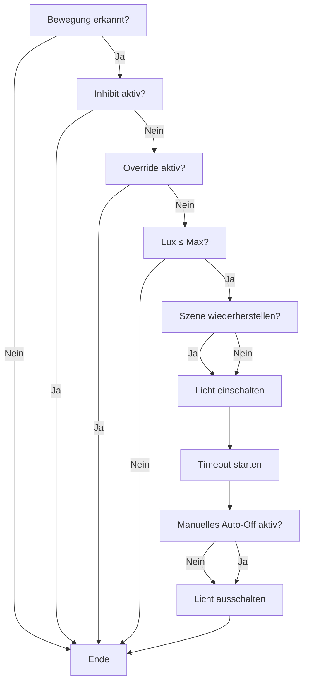

# MotionLight (Symcon Modul)

Dieses Modul steuert automatisch Lichter anhand von Bewegungsmeldern, Helligkeitssensoren und Statusbedingungen.  
Es eignet sich für einzelne Räume und lässt sich flexibel konfigurieren.

---

## Funktionsweise

- Erkennt Bewegung → schaltet definierte Lichter ein (Dimmer oder Schalter).  
- Berücksichtigt optional Helligkeit (Lux).  
- Schaltet Lichter nach einer einstellbaren Zeit wieder aus (Auto-Off).  
- Kann auch manuell eingeschaltete Lichter automatisch ausschalten (optional).  
- Unterstützt Inhibit-Variablen (z. B. „Schlafen“) – solange eine dieser Variablen **TRUE** ist, wird **keine Bewegungsschaltung** ausgeführt.  
- Unterstützt Szene-Sicherung und -Wiederherstellung:  
  - Speichert den Zustand aller Lichter beim Ausschalten.  
  - Stellt diesen Zustand wieder her, wenn „Szene bei nächster Bewegung wiederherstellen“ aktiviert ist.  

---

## Konfiguration im Modul

### Bewegungsmelder
- Auswahl einer Bool-Variable (TRUE bei Bewegung, FALSE wenn keine Bewegung).
- Mehrere Bewegungsmelder pro Instanz möglich.

### Lichter
- Jeder Eintrag besteht aus:
  - **Helligkeitsvariable**: Integer-Wert (z. B. 0–100 oder 0–255).
  - **Ein/Aus/Statusvariable**: Bool-Wert zum Schalten.
- Unterschiedliche Lichter können einzeln oder gemeinsam gesteuert werden.
- Modul merkt sich pro Licht den letzten Helligkeitswert.

### Lux-Variable (optional)
- Integer-Variable eines Helligkeitssensors.  
- Wenn kein Sensor eingetragen ist → Lux wird ignoriert.  

### Lux Max
- Schwellenwert für Einschalten.  
- Lichter werden **nur** eingeschaltet, wenn aktueller Lux-Wert ≤ Lux Max liegt.  

### Timeout (s)
- Dauer in Sekunden, bis das Licht nach der letzten Bewegung automatisch ausgeschaltet wird.  
- Einstellbar direkt im Modul oder über die API (`RML_SetTimeoutSec`).  

### Szene bei nächster Bewegung wiederherstellen
- Wenn aktiviert:
  - Beim Ausschalten merkt sich das Modul den Zustand aller Lichter.  
  - Bei der nächsten Bewegung wird dieser Zustand wiederhergestellt (statt Standardhelligkeit).  

### Manuelles Auto-Off aktiv
- Wenn **aktiviert**:
  - Auch manuell eingeschaltete Lichter werden nach Ablauf des Timeouts automatisch ausgeschaltet.  
- Wenn **deaktiviert**:
  - Nur automatisch eingeschaltete Lichter werden vom Modul wieder ausgeschaltet.  

### Override/Inhibit
- Variable „Override“ blockiert nur das **Auto-Einschalten**.  
- Globale oder Raum-Statusvariablen (z. B. „Schlafen“, „Film-Modus“) blockieren **immer** das Auto-Einschalten.  

---

## Debugging / Test

- Im Modul gibt es drei Debug-Buttons:
  - **Szene speichern**
  - **Szene laden**
  - **Szene zurücksetzen**
- Zusätzlich kann eine Timer-Variable (Countdown) angezeigt werden, um das Auto-Off visuell zu prüfen.

---

## RML_-Funktionen (für Skripte)

Das Modul stellt folgende öffentliche Funktionen bereit:

```php
// Timeout in Sekunden setzen (5–3600)
RML_SetTimeoutSec(int $InstanceID, int $Seconds);

// Standard-Dimmwert setzen (1–100 %)
RML_SetDefaultDim(int $InstanceID, int $Value);

// Maximal erlaubten Lux-Wert setzen
RML_SetLuxMax(int $InstanceID, int $Value);

// Verhalten "Manuelles Auto-Off" aktivieren/deaktivieren
RML_SetManualAutoOff(int $InstanceID, bool $Active);

// Szene sichern (alle aktuellen Lichtzustände speichern)
RML_StoreScene(int $InstanceID);

// Szene wiederherstellen (gesicherte Lichtzustände setzen)
RML_RestoreScene(int $InstanceID);

// Szene zurücksetzen (gesicherte Zustände löschen)
RML_ClearScene(int $InstanceID);

---

## Flowchart

Das folgende Ablaufdiagramm bildet die Entscheidungslogik des Moduls ab:

